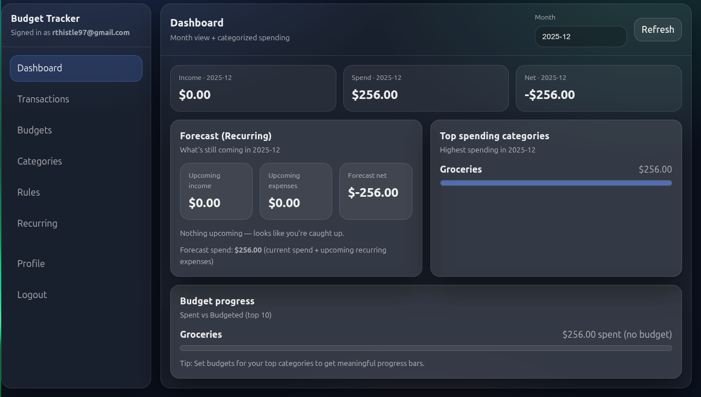
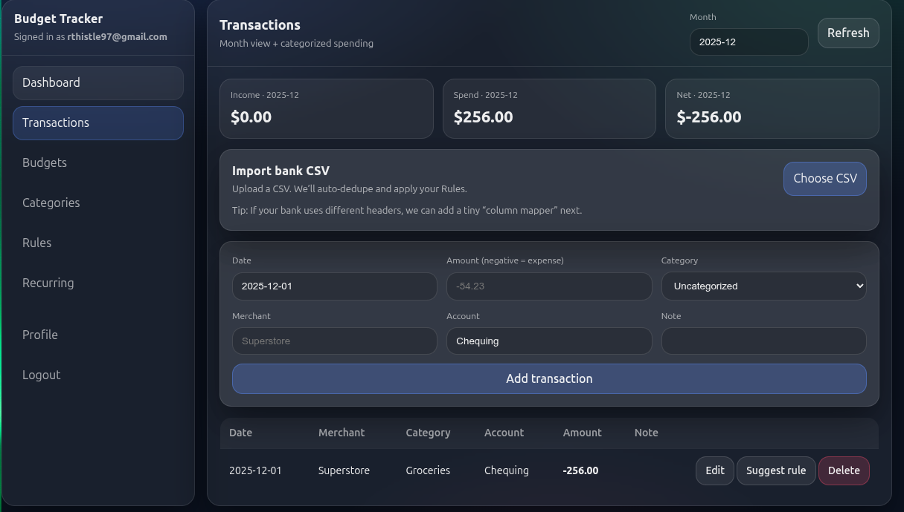

# Budget Tracker (Full-Stack)

A full-stack budgeting web application that allows users to securely manage their finances with authentication, transaction tracking, budgets, rules, and CSV imports.

This project was built to demonstrate real-world dashboard development, clean UI state management, and practical full-stack architecture.

---

## Features

- 🔐 **Authentication**
  - User registration and login
  - Session-based authentication
  - Protected routes per user

- 💸 **Transactions**
  - Add, edit, and delete transactions
  - Month-based views
  - Category filtering

- 🗂 **Categories & Budgets**
  - Create and delete categories
  - Assign budgets and track spending

- ⚙️ **Rules Engine**
  - Automatically categorize transactions based on rules

- 📄 **CSV Import**
  - Upload CSV files
  - Map CSV columns to required fields
  - Dry-run validation before importing
  - Import only valid rows

- 📱 **Responsive UI**
  - Works on desktop and mobile devices

---

## Tech Stack

- **Frontend:** React (Vite)
- **Backend:** Node.js + Express
- **Database:** SQLite + Prisma
- **Authentication:** express-session (stored in SQLite)
- **Styling:** CSS

---

## Screenshots

> Screenshots are located in the `/screenshots` folder.





---

## Local Setup

### 1) Clone the repository
```bash
git clone https://github.com/Rthistle-Data/budget-tracker.git
cd budget-tracker

2) Backend setup
cd server
npm install


Create a .env file:

cp .env.example .env


Edit .env and add your own values.

Start the server:

npm run dev

3) Frontend setup
cd ../web
npm install
npm run dev
